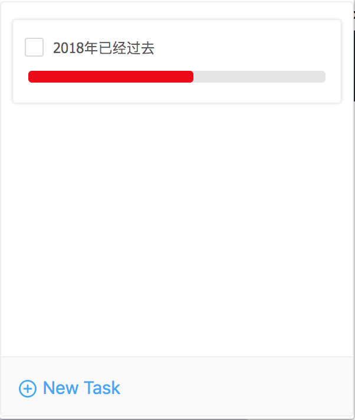
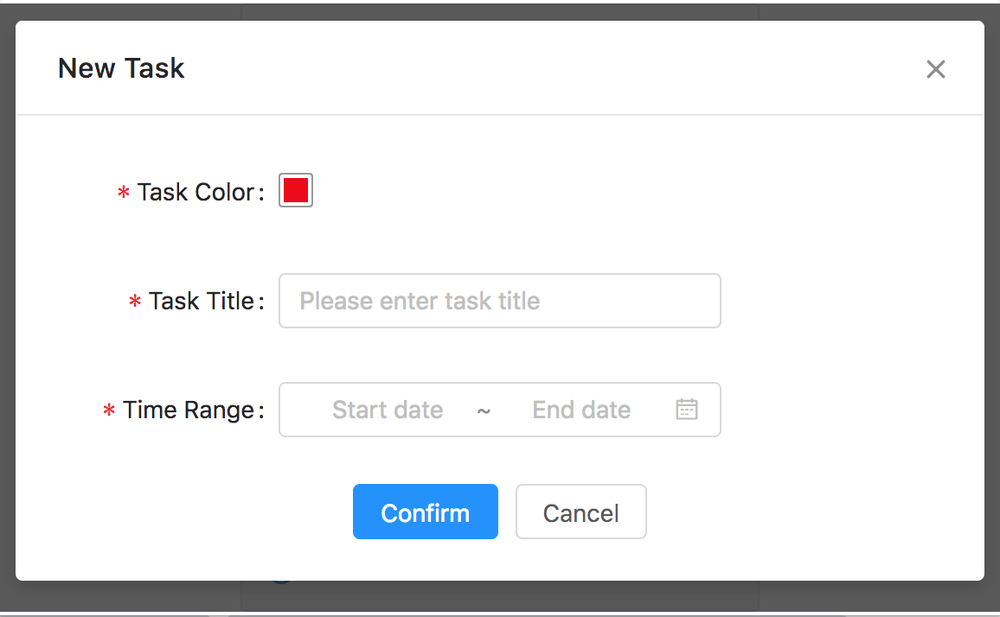

# Timeline
A chrome extension of time

# Development

### Development Mode

```
npm run dev
```

Then add build folder to chrome extension.

### Production Mode

```
npm run prod
```

dist folder is production version of chrome extension, which can be released.

# Demo

<p align="center">
  
</p>

<p align="center">
  
</p>
